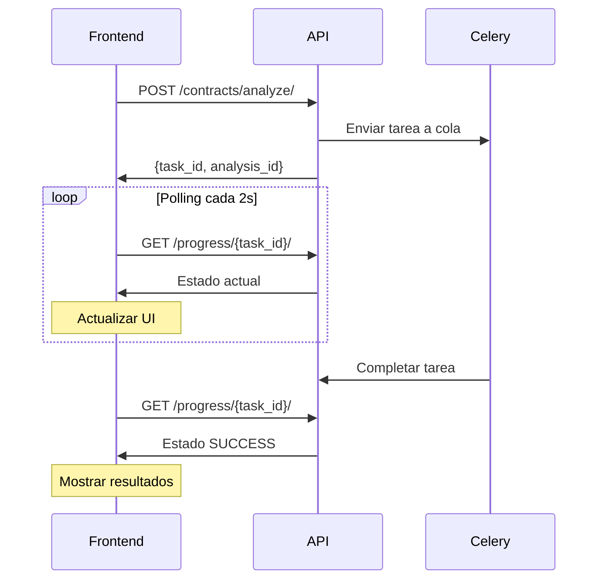

# Sistema de Monitoreo de Progreso en Tiempo Real - Guía de Implementación Frontend

## 🎯 Descripción General

Este sistema permite monitorear el progreso de análisis de contratos en tiempo real usando una API REST con polling. Compatible con cualquier framework frontend (React, Vue, Angular, Vanilla JS, etc.).

## 📋 Tabla de Contenidos

- [API Endpoints](#api-endpoints)
- [Flujo de Implementación](#flujo-de-implementación)
- [Estados y Respuestas](#estados-y-respuestas)
- [Implementaciones por Framework](#implementaciones-por-framework)
- [Componentes UI](#componentes-ui)
- [Mejores Prácticas](#mejores-prácticas)
- [Solución de Problemas](#solución-de-problemas)

## 🔗 API Endpoints

### 1. Iniciar Análisis
```http
POST /api/contracts/analyze/
Content-Type: application/json
Authorization: Bearer {token}

{
  "document_id": "uuid-del-documento",
  "contract_type": "mortgage|rent|services|employment|transfers",
  "analysis_options": {
    "use_together_extraction": true,
    "include_legal_precedents": true
  }
}
```

**Respuesta exitosa (201):**
```json
{
  "success": true,
  "data": {
    "analysis_id": "uuid-del-analisis",
    "analysis_state": "QUEUED",
    "document_id": "uuid-del-documento",
    "task_id": "celery-task-id"
  },
  "message": "Análisis iniciado exitosamente"
}
```

### 2. Consultar Progreso
```http
GET /api/contracts/analysis/progress/{task_id}/
Authorization: Bearer {token}
```

**Respuestas posibles:**

#### En Cola (PENDING)
```json
{
  "success": true,
  "data": {
    "task_id": "celery-task-id",
    "state": "PENDING",
    "stage": "En cola",
    "progress": 0,
    "description": "La tarea está en cola esperando ser procesada"
  }
}
```

#### En Progreso (PROGRESS)
```json
{
  "success": true,
  "data": {
    "task_id": "celery-task-id",
    "state": "PROGRESS",
    "stage": "Analizando cláusulas",
    "progress": 65,
    "total_steps": 8,
    "current_step": 5,
    "description": "Analizando 12 cláusulas con IA avanzada",
    "details": {
      "clauses_extracted": 12,
      "clauses_saved": 12,
      "embeddings_generated": 12,
      "total_clauses": 12,
      "clauses_analyzed": 8,
      "flagged_clauses": 2
    }
  }
}
```

#### Completado (SUCCESS)
```json
{
  "success": true,
  "data": {
    "task_id": "celery-task-id",
    "state": "SUCCESS",
    "stage": "Completado",
    "progress": 100,
    "description": "Análisis completado exitosamente",
    "result": {
      "analysis_id": "uuid-del-analisis",
      "total_clauses": 12,
      "flagged_clauses": 2,
      "overall_favorability": "favorable",
      "risk_score": 3.2,
      "processing_time_seconds": 245
    }
  }
}
```

#### Error (FAILURE)
```json
{
  "success": true,
  "data": {
    "task_id": "celery-task-id",
    "state": "FAILURE",
    "stage": "Error",
    "progress": 0,
    "description": "Error en el análisis: Timeout de conexión",
    "error": "Timeout de conexión con el servicio de IA"
  }
}
```

## 🔄 Flujo de Implementación

### 1. Secuencia Típica



### 2. Estados del Proceso

| Etapa | Progreso | Descripción |
|-------|----------|-------------|
| **Inicio** | 0% | Preparando análisis del contrato |
| **Extracción** | 25% | Extrayendo cláusulas con IA |
| **Guardado** | 37% | Guardando cláusulas en base de datos |
| **Embeddings** | 37-50% | Generando embeddings para búsqueda |
| **Análisis** | 50-62% | Analizando cláusulas con IA |
| **Métricas** | 62-75% | Calculando métricas generales |
| **Resumen** | 75-100% | Generando resumen ejecutivo |
| **Completado** | 100% | Análisis finalizado |

## 🚀 Implementaciones por Framework

### React (Hooks)

```jsx
import { useState, useEffect, useCallback } from 'react';

const useContractAnalysis = () => {
  const [taskId, setTaskId] = useState(null);
  const [progress, setProgress] = useState(null);
  const [isLoading, setIsLoading] = useState(false);
  const [error, setError] = useState(null);

  const startAnalysis = async (documentId, contractType = 'mortgage') => {
    setIsLoading(true);
    setError(null);
    
    try {
      const response = await fetch('/api/contracts/analyze/', {
        method: 'POST',
        headers: {
          'Content-Type': 'application/json',
          'Authorization': `Bearer ${getAuthToken()}`
        },
        body: JSON.stringify({
          document_id: documentId,
          contract_type: contractType,
          analysis_options: {
            use_together_extraction: true,
            include_legal_precedents: true
          }
        })
      });

      const data = await response.json();
      
      if (!data.success) {
        throw new Error(data.error || 'Error al iniciar análisis');
      }

      setTaskId(data.data.task_id);
    } catch (err) {
      setError(err.message);
    } finally {
      setIsLoading(false);
    }
  };

  const checkProgress = useCallback(async () => {
    if (!taskId) return;

    try {
      const response = await fetch(`/api/contracts/analysis/progress/${taskId}/`, {
        headers: {
          'Authorization': `Bearer ${getAuthToken()}`
        }
      });

      const data = await response.json();
      
      if (data.success) {
        setProgress(data.data);
        
        if (['SUCCESS', 'FAILURE'].includes(data.data.state)) {
          setTaskId(null); // Detener polling
        }
      }
    } catch (err) {
      console.error('Error checking progress:', err);
    }
  }, [taskId]);

  // Polling effect
  useEffect(() => {
    if (!taskId) return;

    const interval = setInterval(checkProgress, 2000);
    return () => clearInterval(interval);
  }, [taskId, checkProgress]);

  return {
    startAnalysis,
    progress,
    isLoading,
    error,
    isAnalyzing: !!taskId
  };
};

// Componente de UI
const ContractAnalysisProgress = ({ documentId }) => {
  const { startAnalysis, progress, isLoading, error, isAnalyzing } = useContractAnalysis();

  const handleStart = () => {
    startAnalysis(documentId, 'mortgage');
  };

  if (error) {
    return (
      <div className="alert alert-error">
        <strong>Error:</strong> {error}
      </div>
    );
  }

  if (!isAnalyzing && !progress) {
    return (
      <button 
        onClick={handleStart} 
        disabled={isLoading}
        className="btn btn-primary"
      >
        {isLoading ? 'Iniciando...' : 'Iniciar Análisis'}
      </button>
    );
  }

  return (
    <div className="analysis-progress">
      <h3>Análisis en Progreso</h3>
      
      <div className="progress-bar">
        <div 
          className="progress-fill" 
          style={{ width: `${progress?.progress || 0}%` }}
        >
          {progress?.progress || 0}%
        </div>
      </div>
      
      <div className="progress-info">
        <p><strong>Estado:</strong> {progress?.stage}</p>
        <p>{progress?.description}</p>
        
        {progress?.details && (
          <div className="details">
            {progress.details.total_clauses && (
              <span>Total cláusulas: {progress.details.total_clauses}</span>
            )}
            {progress.details.flagged_clauses !== undefined && (
              <span>Problemáticas: {progress.details.flagged_clauses}</span>
            )}
          </div>
        )}
      </div>
      
      {progress?.state === 'SUCCESS' && (
        <div className="results">
          <h4>¡Análisis Completado!</h4>
          <ul>
            <li>Cláusulas analizadas: {progress.result?.total_clauses}</li>
            <li>Cláusulas problemáticas: {progress.result?.flagged_clauses}</li>
            <li>Favorabilidad: {progress.result?.overall_favorability}</li>
            <li>Puntuación de riesgo: {progress.result?.risk_score}</li>
          </ul>
        </div>
      )}
    </div>
  );
};

export { useContractAnalysis, ContractAnalysisProgress };
```

### Vue 3 (Composition API)

```vue
<template>
  <div class="contract-analysis">
    <div v-if="error" class="alert alert-error">
      <strong>Error:</strong> {{ error }}
    </div>
    
    <button 
      v-if="!isAnalyzing && !progress"
      @click="handleStartAnalysis"
      :disabled="isLoading"
      class="btn btn-primary"
    >
      {{ isLoading ? 'Iniciando...' : 'Iniciar Análisis' }}
    </button>
    
    <div v-if="isAnalyzing || progress" class="analysis-progress">
      <h3>Análisis en Progreso</h3>
      
      <div class="progress-bar">
        <div 
          class="progress-fill" 
          :style="{ width: `${progress?.progress || 0}%` }"
        >
          {{ progress?.progress || 0 }}%
        </div>
      </div>
      
      <div class="progress-info">
        <p><strong>Estado:</strong> {{ progress?.stage }}</p>
        <p>{{ progress?.description }}</p>
        
        <div v-if="progress?.details" class="details">
          <span v-if="progress.details.total_clauses">
            Total cláusulas: {{ progress.details.total_clauses }}
          </span>
          <span v-if="progress.details.flagged_clauses !== undefined">
            Problemáticas: {{ progress.details.flagged_clauses }}
          </span>
        </div>
      </div>
      
      <div v-if="progress?.state === 'SUCCESS'" class="results">
        <h4>¡Análisis Completado!</h4>
        <ul>
          <li>Cláusulas analizadas: {{ progress.result?.total_clauses }}</li>
          <li>Cláusulas problemáticas: {{ progress.result?.flagged_clauses }}</li>
          <li>Favorabilidad: {{ progress.result?.overall_favorability }}</li>
          <li>Puntuación de riesgo: {{ progress.result?.risk_score }}</li>
        </ul>
      </div>
    </div>
  </div>
</template>

<script setup>
import { ref, watch, onUnmounted } from 'vue'

const props = defineProps({
  documentId: {
    type: String,
    required: true
  }
})

const taskId = ref(null)
const progress = ref(null)
const isLoading = ref(false)
const error = ref(null)
const progressInterval = ref(null)

const isAnalyzing = computed(() => !!taskId.value)

const getAuthToken = () => {
  return localStorage.getItem('auth_token') || ''
}

const startAnalysis = async (documentId, contractType = 'mortgage') => {
  isLoading.value = true
  error.value = null
  
  try {
    const response = await fetch('/api/contracts/analyze/', {
      method: 'POST',
      headers: {
        'Content-Type': 'application/json',
        'Authorization': `Bearer ${getAuthToken()}`
      },
      body: JSON.stringify({
        document_id: documentId,
        contract_type: contractType,
        analysis_options: {
          use_together_extraction: true,
          include_legal_precedents: true
        }
      })
    })

    const data = await response.json()
    
    if (!data.success) {
      throw new Error(data.error || 'Error al iniciar análisis')
    }

    taskId.value = data.data.task_id
  } catch (err) {
    error.value = err.message
  } finally {
    isLoading.value = false
  }
}

const checkProgress = async () => {
  if (!taskId.value) return

  try {
    const response = await fetch(`/api/contracts/analysis/progress/${taskId.value}/`, {
      headers: {
        'Authorization': `Bearer ${getAuthToken()}`
      }
    })

    const data = await response.json()
    
    if (data.success) {
      progress.value = data.data
      
      if (['SUCCESS', 'FAILURE'].includes(data.data.state)) {
        stopPolling()
      }
    }
  } catch (err) {
    console.error('Error checking progress:', err)
  }
}

const startPolling = () => {
  progressInterval.value = setInterval(checkProgress, 2000)
}

const stopPolling = () => {
  if (progressInterval.value) {
    clearInterval(progressInterval.value)
    progressInterval.value = null
  }
}

const handleStartAnalysis = () => {
  startAnalysis(props.documentId, 'mortgage')
}

// Watch for taskId changes to start/stop polling
watch(taskId, (newTaskId) => {
  if (newTaskId) {
    startPolling()
  } else {
    stopPolling()
  }
})

// Cleanup on unmount
onUnmounted(() => {
  stopPolling()
})
</script>
```

### Angular (Service + Component)

```typescript
// contract-analysis.service.ts
import { Injectable } from '@angular/core';
import { HttpClient, HttpHeaders } from '@angular/common/http';
import { BehaviorSubject, interval, EMPTY } from 'rxjs';
import { switchMap, takeWhile, catchError } from 'rxjs/operators';

export interface ProgressData {
  task_id: string;
  state: string;
  stage: string;
  progress: number;
  description: string;
  details?: any;
  result?: any;
}

@Injectable({
  providedIn: 'root'
})
export class ContractAnalysisService {
  private progressSubject = new BehaviorSubject<ProgressData | null>(null);
  private errorSubject = new BehaviorSubject<string | null>(null);
  private loadingSubject = new BehaviorSubject<boolean>(false);

  public progress$ = this.progressSubject.asObservable();
  public error$ = this.errorSubject.asObservable();
  public loading$ = this.loadingSubject.asObservable();

  constructor(private http: HttpClient) {}

  private getHeaders(): HttpHeaders {
    const token = localStorage.getItem('auth_token');
    return new HttpHeaders({
      'Content-Type': 'application/json',
      'Authorization': `Bearer ${token}`
    });
  }

  async startAnalysis(documentId: string, contractType: string = 'mortgage'): Promise<void> {
    this.loadingSubject.next(true);
    this.errorSubject.next(null);

    try {
      const response = await this.http.post<any>('/api/contracts/analyze/', {
        document_id: documentId,
        contract_type: contractType,
        analysis_options: {
          use_together_extraction: true,
          include_legal_precedents: true
        }
      }, { headers: this.getHeaders() }).toPromise();

      if (!response.success) {
        throw new Error(response.error || 'Error al iniciar análisis');
      }

      this.startProgressMonitoring(response.data.task_id);
    } catch (error) {
      this.errorSubject.next(error.message);
    } finally {
      this.loadingSubject.next(false);
    }
  }

  private startProgressMonitoring(taskId: string): void {
    interval(2000).pipe(
      switchMap(() => this.checkProgress(taskId)),
      takeWhile((progress) => !['SUCCESS', 'FAILURE'].includes(progress.state), true),
      catchError((error) => {
        console.error('Error monitoring progress:', error);
        return EMPTY;
      })
    ).subscribe((progress) => {
      this.progressSubject.next(progress);
    });
  }

  private checkProgress(taskId: string) {
    return this.http.get<any>(`/api/contracts/analysis/progress/${taskId}/`, {
      headers: this.getHeaders()
    }).pipe(
      switchMap((response) => {
        if (response.success) {
          return [response.data];
        } else {
          throw new Error('Error checking progress');
        }
      })
    );
  }
}

// contract-analysis.component.ts
import { Component, Input } from '@angular/core';
import { ContractAnalysisService, ProgressData } from './contract-analysis.service';
import { Observable } from 'rxjs';

@Component({
  selector: 'app-contract-analysis',
  template: `
    <div class="contract-analysis">
      <div *ngIf="error$ | async as error" class="alert alert-error">
        <strong>Error:</strong> {{ error }}
      </div>
      
      <button 
        *ngIf="!(progress$ | async)"
        (click)="startAnalysis()"
        [disabled]="loading$ | async"
        class="btn btn-primary"
      >
        {{ (loading$ | async) ? 'Iniciando...' : 'Iniciar Análisis' }}
      </button>
      
      <div *ngIf="progress$ | async as progress" class="analysis-progress">
        <h3>Análisis en Progreso</h3>
        
        <div class="progress-bar">
          <div 
            class="progress-fill" 
            [style.width.%]="progress.progress"
          >
            {{ progress.progress }}%
          </div>
        </div>
        
        <div class="progress-info">
          <p><strong>Estado:</strong> {{ progress.stage }}</p>
          <p>{{ progress.description }}</p>
          
          <div *ngIf="progress.details" class="details">
            <span *ngIf="progress.details.total_clauses">
              Total cláusulas: {{ progress.details.total_clauses }}
            </span>
            <span *ngIf="progress.details.flagged_clauses !== undefined">
              Problemáticas: {{ progress.details.flagged_clauses }}
            </span>
          </div>
        </div>
        
        <div *ngIf="progress.state === 'SUCCESS'" class="results">
          <h4>¡Análisis Completado!</h4>
          <ul>
            <li>Cláusulas analizadas: {{ progress.result?.total_clauses }}</li>
            <li>Cláusulas problemáticas: {{ progress.result?.flagged_clauses }}</li>
            <li>Favorabilidad: {{ progress.result?.overall_favorability }}</li>
            <li>Puntuación de riesgo: {{ progress.result?.risk_score }}</li>
          </ul>
        </div>
      </div>
    </div>
  `
})
export class ContractAnalysisComponent {
  @Input() documentId!: string;

  progress$: Observable<ProgressData | null>;
  error$: Observable<string | null>;
  loading$: Observable<boolean>;

  constructor(private analysisService: ContractAnalysisService) {
    this.progress$ = this.analysisService.progress$;
    this.error$ = this.analysisService.error$;
    this.loading$ = this.analysisService.loading$;
  }

  startAnalysis(): void {
    this.analysisService.startAnalysis(this.documentId, 'mortgage');
  }
}
```

### Vanilla JavaScript

```javascript
class ContractAnalysisMonitor {
  constructor(options = {}) {
    this.baseUrl = options.baseUrl || '/api';
    this.pollInterval = options.pollInterval || 2000;
    this.onProgress = options.onProgress || this.defaultOnProgress;
    this.onComplete = options.onComplete || this.defaultOnComplete;
    this.onError = options.onError || this.defaultOnError;
    
    this.taskId = null;
    this.intervalId = null;
    this.isMonitoring = false;
  }

  getAuthToken() {
    return localStorage.getItem('auth_token') || '';
  }

  async startAnalysis(documentId, contractType = 'mortgage') {
    try {
      const response = await fetch(`${this.baseUrl}/contracts/analyze/`, {
        method: 'POST',
        headers: {
          'Content-Type': 'application/json',
          'Authorization': `Bearer ${this.getAuthToken()}`
        },
        body: JSON.stringify({
          document_id: documentId,
          contract_type: contractType,
          analysis_options: {
            use_together_extraction: true,
            include_legal_precedents: true
          }
        })
      });

      const data = await response.json();
      
      if (!data.success) {
        throw new Error(data.error || 'Error al iniciar análisis');
      }

      this.taskId = data.data.task_id;
      this.startMonitoring();
      
      return data;
    } catch (error) {
      this.onError(error.message);
      throw error;
    }
  }

  startMonitoring() {
    if (this.isMonitoring) return;
    
    this.isMonitoring = true;
    this.intervalId = setInterval(() => this.checkProgress(), this.pollInterval);
  }

  stopMonitoring() {
    if (this.intervalId) {
      clearInterval(this.intervalId);
      this.intervalId = null;
      this.isMonitoring = false;
    }
  }

  async checkProgress() {
    if (!this.taskId) return;

    try {
      const response = await fetch(`${this.baseUrl}/contracts/analysis/progress/${this.taskId}/`, {
        headers: {
          'Authorization': `Bearer ${this.getAuthToken()}`
        }
      });

      const data = await response.json();
      
      if (data.success) {
        this.onProgress(data.data);
        
        if (['SUCCESS', 'FAILURE'].includes(data.data.state)) {
          this.stopMonitoring();
          
          if (data.data.state === 'SUCCESS') {
            this.onComplete(data.data);
          } else {
            this.onError(data.data.error || 'Análisis falló');
          }
        }
      }
    } catch (error) {
      console.error('Error checking progress:', error);
    }
  }

  defaultOnProgress(progress) {
    console.log(`Progreso: ${progress.progress}% - ${progress.stage}`);
  }

  defaultOnComplete(result) {
    console.log('Análisis completado:', result);
  }

  defaultOnError(error) {
    console.error('Error:', error);
  }
}

// Uso
const monitor = new ContractAnalysisMonitor({
  onProgress: (progress) => {
    document.getElementById('progress-bar').style.width = `${progress.progress}%`;
    document.getElementById('progress-text').textContent = progress.description;
  },
  onComplete: (result) => {
    alert('¡Análisis completado exitosamente!');
  },
  onError: (error) => {
    alert(`Error: ${error}`);
  }
});

monitor.startAnalysis('document-uuid', 'mortgage');
```

## 🎨 Componentes UI

### CSS Base

```css
.analysis-progress {
  max-width: 500px;
  margin: 20px auto;
  padding: 20px;
  border: 1px solid #ddd;
  border-radius: 8px;
  font-family: -apple-system, BlinkMacSystemFont, 'Segoe UI', Roboto, sans-serif;
}

.progress-bar {
  width: 100%;
  height: 25px;
  background-color: #f0f0f0;
  border-radius: 12px;
  overflow: hidden;
  margin: 15px 0;
  position: relative;
}

.progress-fill {
  height: 100%;
  background: linear-gradient(90deg, #007bff, #0056b3);
  transition: width 0.5s ease;
  display: flex;
  align-items: center;
  justify-content: center;
  color: white;
  font-weight: bold;
  font-size: 12px;
}

.progress-info {
  margin-top: 15px;
}

.progress-info p {
  margin: 5px 0;
  color: #333;
}

.details {
  margin-top: 10px;
  font-size: 0.9em;
  color: #666;
}

.details span {
  display: inline-block;
  margin-right: 15px;
  padding: 2px 8px;
  background: #f8f9fa;
  border-radius: 4px;
}

.results {
  margin-top: 20px;
  padding: 15px;
  background: #d4edda;
  border: 1px solid #c3e6cb;
  border-radius: 6px;
  color: #155724;
}

.results h4 {
  margin: 0 0 10px 0;
  color: #155724;
}

.results ul {
  margin: 0;
  padding-left: 20px;
}

.alert {
  padding: 12px 16px;
  margin-bottom: 20px;
  border: 1px solid transparent;
  border-radius: 6px;
}

.alert-error {
  color: #721c24;
  background-color: #f8d7da;
  border-color: #f5c6cb;
}

.btn {
  padding: 10px 20px;
  border: none;
  border-radius: 6px;
  cursor: pointer;
  font-size: 14px;
  font-weight: 500;
  transition: all 0.2s ease;
}

.btn-primary {
  background-color: #007bff;
  color: white;
}

.btn-primary:hover:not(:disabled) {
  background-color: #0056b3;
}

.btn:disabled {
  opacity: 0.6;
  cursor: not-allowed;
}

/* Animación de pulso para estado activo */
.progress-fill.pulse {
  animation: pulse 2s infinite;
}

@keyframes pulse {
  0%, 100% { opacity: 1; }
  50% { opacity: 0.7; }
}

/* Responsive */
@media (max-width: 600px) {
  .analysis-progress {
    margin: 10px;
    padding: 15px;
  }
  
  .details span {
    display: block;
    margin: 3px 0;
  }
}
```

### HTML Template

```html
<div id="contract-analysis-container" class="analysis-progress">
  <!-- Estado inicial -->
  <div id="initial-state">
    <h3>Análisis de Contrato</h3>
    <button id="start-analysis" class="btn btn-primary">
      Iniciar Análisis
    </button>
  </div>

  <!-- Estado de progreso -->
  <div id="progress-state" style="display: none;">
    <h3>Análisis en Progreso</h3>
    
    <div class="progress-bar">
      <div id="progress-fill" class="progress-fill" style="width: 0%;">
        <span id="progress-percentage">0%</span>
      </div>
    </div>
    
    <div class="progress-info">
      <p><strong>Estado:</strong> <span id="current-stage">Iniciando...</span></p>
      <p id="progress-description">Preparando análisis...</p>
      
      <div id="progress-details" class="details">
        <!-- Se llena dinámicamente -->
      </div>
    </div>
  </div>

  <!-- Estado de resultados -->
  <div id="results-state" style="display: none;">
    <div class="results">
      <h4>¡Análisis Completado Exitosamente!</h4>
      <ul id="results-list">
        <!-- Se llena dinámicamente -->
      </ul>
      <button id="view-full-results" class="btn btn-primary">
        Ver Análisis Completo
      </button>
    </div>
  </div>

  <!-- Estado de error -->
  <div id="error-state" style="display: none;">
    <div class="alert alert-error">
      <strong>Error:</strong> <span id="error-message"></span>
    </div>
    <button id="retry-analysis" class="btn btn-primary">
      Reintentar
    </button>
  </div>
</div>
```

## ⚡ Mejores Prácticas

### 1. Gestión de Estados
```javascript
class AnalysisStateManager {
  constructor() {
    this.states = {
      IDLE: 'idle',
      STARTING: 'starting',
      MONITORING: 'monitoring',
      COMPLETED: 'completed',
      ERROR: 'error'
    };
    this.currentState = this.states.IDLE;
  }

  setState(newState) {
    console.log(`State transition: ${this.currentState} -> ${newState}`);
    this.currentState = newState;
    this.updateUI();
  }

  updateUI() {
    // Ocultar todos los estados
    document.querySelectorAll('[id$="-state"]').forEach(el => {
      el.style.display = 'none';
    });

    // Mostrar estado actual
    switch(this.currentState) {
      case this.states.IDLE:
        document.getElementById('initial-state').style.display = 'block';
        break;
      case this.states.STARTING:
      case this.states.MONITORING:
        document.getElementById('progress-state').style.display = 'block';
        break;
      case this.states.COMPLETED:
        document.getElementById('results-state').style.display = 'block';
        break;
      case this.states.ERROR:
        document.getElementById('error-state').style.display = 'block';
        break;
    }
  }
}
```

### 2. Manejo de Errores Robusto
```javascript
const handleError = (error, context) => {
  const errorTypes = {
    NETWORK: 'Error de conexión',
    AUTH: 'Error de autenticación',
    VALIDATION: 'Error de validación',
    TIMEOUT: 'Tiempo de espera agotado',
    SERVER: 'Error del servidor'
  };

  let errorType = 'SERVER';
  let userMessage = error.message;

  if (error.name === 'TypeError' && error.message.includes('fetch')) {
    errorType = 'NETWORK';
    userMessage = 'No se pudo conectar al servidor. Verifica tu conexión.';
  } else if (error.status === 401) {
    errorType = 'AUTH';
    userMessage = 'Tu sesión ha expirado. Por favor, inicia sesión nuevamente.';
  } else if (error.status === 400) {
    errorType = 'VALIDATION';
    userMessage = 'Los datos enviados no son válidos.';
  }

  console.error(`[${context}] ${errorType}:`, error);
  
  // Mostrar mensaje amigable al usuario
  showErrorMessage(userMessage, errorType);
  
  // Telemetría (opcional)
  if (window.analytics) {
    window.analytics.track('Analysis Error', {
      error_type: errorType,
      error_message: error.message,
      context: context
    });
  }
};
```

### 3. Optimización de Performance
```javascript
class ProgressOptimizer {
  constructor() {
    this.lastUpdate = 0;
    this.throttleDelay = 100; // ms
    this.updateQueue = new Set();
  }

  throttledUpdate(updateFn) {
    const now = Date.now();
    
    if (now - this.lastUpdate >= this.throttleDelay) {
      updateFn();
      this.lastUpdate = now;
    } else {
      // Queue para siguiente actualización
      this.updateQueue.add(updateFn);
      this.scheduleNextUpdate();
    }
  }

  scheduleNextUpdate() {
    if (this.updateQueue.size === 0) return;

    const delay = this.throttleDelay - (Date.now() - this.lastUpdate);
    
    setTimeout(() => {
      const updates = Array.from(this.updateQueue);
      this.updateQueue.clear();
      
      // Ejecutar solo la última actualización
      if (updates.length > 0) {
        updates[updates.length - 1]();
        this.lastUpdate = Date.now();
      }
    }, Math.max(0, delay));
  }
}
```

### 4. Configuración Adaptable
```javascript
const defaultConfig = {
  polling: {
    interval: 2000,
    maxRetries: 3,
    timeout: 600000, // 10 minutos
    backoffMultiplier: 1.5
  },
  ui: {
    animationDuration: 300,
    showDetails: true,
    autoHideSuccess: false,
    successDelay: 5000
  },
  api: {
    baseUrl: '/api',
    version: 'v1',
    timeout: 30000
  }
};

// Merge con configuración del usuario
const createConfig = (userConfig = {}) => {
  return {
    ...defaultConfig,
    polling: { ...defaultConfig.polling, ...userConfig.polling },
    ui: { ...defaultConfig.ui, ...userConfig.ui },
    api: { ...defaultConfig.api, ...userConfig.api }
  };
};
```

## 🐛 Solución de Problemas

### Problemas Comunes

#### 1. **Polling no se detiene**
```javascript
// Problema: Intervalos múltiples corriendo
// Solución: Siempre limpiar antes de crear nuevo
class PollingManager {
  constructor() {
    this.intervals = new Map();
  }

  start(taskId, callback, interval = 2000) {
    this.stop(taskId); // Limpiar existente
    
    const intervalId = setInterval(callback, interval);
    this.intervals.set(taskId, intervalId);
  }

  stop(taskId) {
    const intervalId = this.intervals.get(taskId);
    if (intervalId) {
      clearInterval(intervalId);
      this.intervals.delete(taskId);
    }
  }

  stopAll() {
    this.intervals.forEach(intervalId => clearInterval(intervalId));
    this.intervals.clear();
  }
}
```

#### 2. **Token expirado durante análisis largo**
```javascript
class TokenManager {
  constructor() {
    this.token = localStorage.getItem('auth_token');
    this.refreshPromise = null;
  }

  async getValidToken() {
    if (this.isTokenExpired(this.token)) {
      if (!this.refreshPromise) {
        this.refreshPromise = this.refreshToken();
      }
      this.token = await this.refreshPromise;
      this.refreshPromise = null;
    }
    return this.token;
  }

  isTokenExpired(token) {
    if (!token) return true;
    try {
      const payload = JSON.parse(atob(token.split('.')[1]));
      return payload.exp < Date.now() / 1000;
    } catch {
      return true;
    }
  }

  async refreshToken() {
    // Implementar según tu sistema de autenticación
    const response = await fetch('/auth/refresh/', {
      method: 'POST',
      headers: { 'Content-Type': 'application/json' },
      body: JSON.stringify({ refresh_token: localStorage.getItem('refresh_token') })
    });
    
    const data = await response.json();
    localStorage.setItem('auth_token', data.access_token);
    return data.access_token;
  }
}
```

#### 3. **Estado inconsistente tras errores de red**
```javascript
class StateRecovery {
  constructor(analysisMonitor) {
    this.monitor = analysisMonitor;
    this.savedState = null;
  }

  saveState() {
    this.savedState = {
      taskId: this.monitor.taskId,
      timestamp: Date.now(),
      lastProgress: this.monitor.lastProgress
    };
    localStorage.setItem('analysis_state', JSON.stringify(this.savedState));
  }

  async recoverState() {
    const saved = localStorage.getItem('analysis_state');
    if (!saved) return false;

    try {
      const state = JSON.parse(saved);
      const elapsed = Date.now() - state.timestamp;
      
      // Solo recuperar si no ha pasado mucho tiempo (ej: 1 hora)
      if (elapsed < 3600000 && state.taskId) {
        const response = await fetch(`/api/contracts/analysis/progress/${state.taskId}/`);
        const data = await response.json();
        
        if (data.success && !['SUCCESS', 'FAILURE'].includes(data.data.state)) {
          this.monitor.taskId = state.taskId;
          this.monitor.startMonitoring();
          return true;
        }
      }
    } catch (error) {
      console.error('Error recovering state:', error);
    }

    localStorage.removeItem('analysis_state');
    return false;
  }
}
```

### Debugging

```javascript
const DEBUG = process.env.NODE_ENV === 'development';

const logger = {
  info: (message, data) => {
    if (DEBUG) console.log(`[Analysis] ${message}`, data);
  },
  error: (message, error) => {
    console.error(`[Analysis Error] ${message}`, error);
  },
  progress: (taskId, progress) => {
    if (DEBUG) {
      console.log(`[Progress ${taskId}] ${progress.progress}% - ${progress.stage}`);
    }
  }
};
```

### Métricas y Telemetría

```javascript
class AnalyticsTracker {
  track(event, properties = {}) {
    // Google Analytics, Mixpanel, etc.
    if (window.gtag) {
      window.gtag('event', event, {
        custom_map: properties,
        event_category: 'Contract Analysis'
      });
    }
    
    if (window.analytics) {
      window.analytics.track(event, {
        ...properties,
        timestamp: new Date().toISOString()
      });
    }
  }

  trackAnalysisStarted(documentType, contractType) {
    this.track('Analysis Started', {
      document_type: documentType,
      contract_type: contractType
    });
  }

  trackAnalysisCompleted(duration, clauses, result) {
    this.track('Analysis Completed', {
      duration_seconds: duration,
      total_clauses: clauses,
      result_favorability: result.overall_favorability,
      risk_score: result.risk_score
    });
  }

  trackAnalysisError(error, stage) {
    this.track('Analysis Error', {
      error_message: error.message,
      error_stage: stage,
      error_type: error.constructor.name
    });
  }
}
```

---

## 📞 Soporte

Para implementaciones específicas o problemas técnicos:

1. **Revisa los logs del servidor** para errores de Celery
2. **Verifica la conectividad** entre frontend y backend
3. **Confirma la autenticación** (tokens válidos)
4. **Monitorea Flower** en `http://localhost:5555` para estado de tareas
5. **Usa herramientas de desarrollo** del navegador para debugear requests

Este sistema es altamente configurable y puede adaptarse a cualquier framework frontend moderno. La clave está en mantener el polling eficiente y manejar correctamente los estados de la aplicación.
